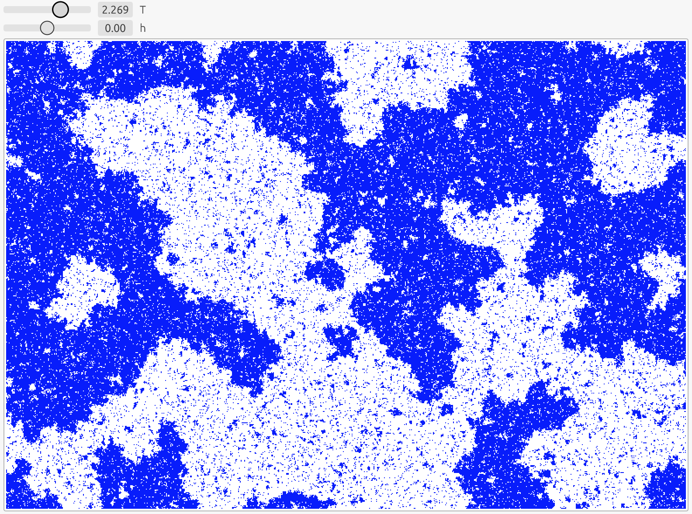

# Phase

This is a phase transition simulation that runs on the web on GPU, with [RustGPU](https://rust-gpu.github.io) and [wgpu](https://github.com/gfx-rs/wgpu).

A live demo is available at [xayon40-12.github.io/phase](https://xayon40-12.github.io/phase).  
**Note:** It needs a WebGPU enabled browser to run. Google Chrome tends to work fine, although not on iOS where it actually uses the same backend as Safari. For iOS/iPadOS, the WebGPU unstable feature can be activated in the settings of Safari to make this

## Physics

This is a simulation of the [Ising model](https://en.wikipedia.org/wiki/Ising_model) which is a great model to study phase transitions. In the present case, it models a two dimensions lattice of spins that interact with their neighbors and with an external field. You can see this as a slice of iron put inside a magnet whose strength and polarity can be controlled with the parameter `h`. Each pixel show the direction of magnetization, which can be either up in blue or down in white. Changing the temperature `T` will control how much noise or randomness there is.

This model can produce behaviors similar to the transition between liquid water and vapor. By varying the external field `h` (which would correspond to changing the pressure in the analogy with water), the transition can be continuous at large temperature, or discontinuous (bubbles) at low temperature. Although magnets and water are very different in nature, it is surprising that they share a similar phase structure.

The default values of `T` and `h` (shown on the figure at the top of this README) correspond to the critical point, which is the point where the discontinuous transition end (see the phase diagram for water on [Wikipedia phase diagram](https://en.wikipedia.org/wiki/Phase_diagram)). This point is very peculiar because it is scale invariant, so there are structures that appear at every scale. It is quite fascinating to stare at. 
